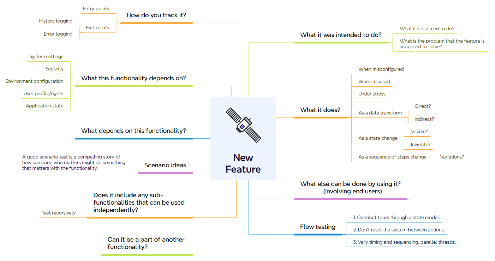
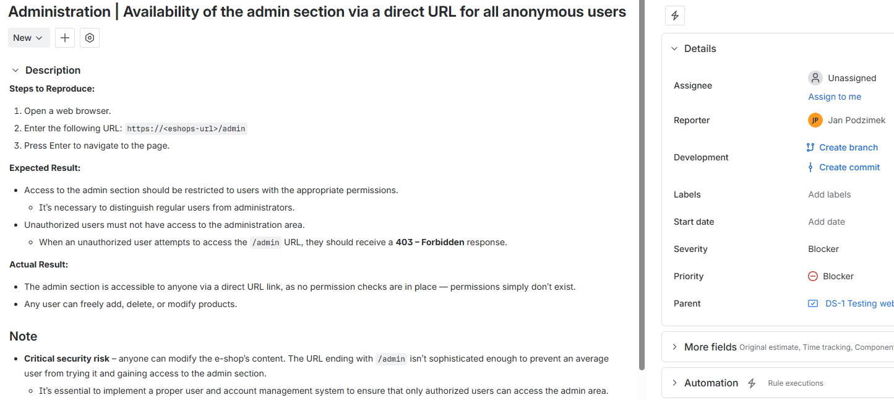
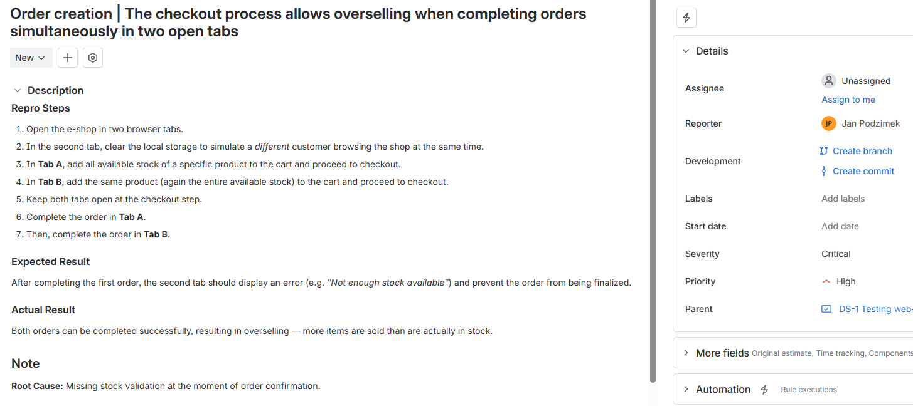
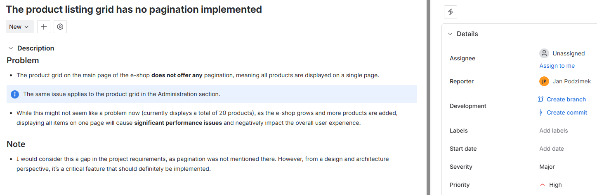
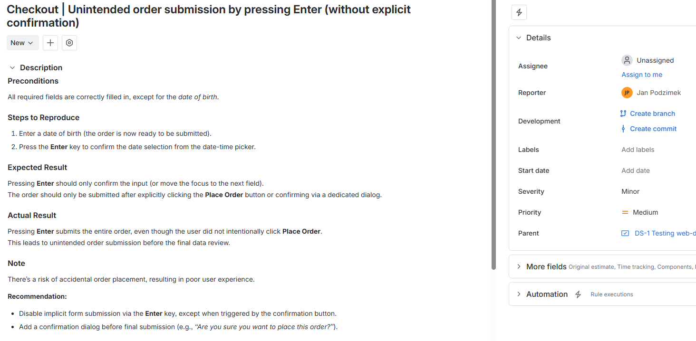

# Jan Podzimek
Personal portfolio showcasing my testing approach, methodology, and selected examples of test work.

## Test strategy
Since my testing strategy varies depending on the product, it’s hard to describe a single approach that I always follow. Instead, I adjust my strategy to the specific testing needs of each project. Here’s an example of what my test strategy might look like:
- I define use cases as sequences of user interactions with the product that represent all the ways I expect typical users to use it.  
- I complement these with stress testing and abnormal use testing, focusing on invalid data and error conditions.  
- I also perform exploratory testing.  
- My top priority is to identify fundamental deviations from the specified behavior, but I also pay close attention to ways the product might violate user expectations.

## Testing framework
A structured testing framework designed to ensure comprehensive coverage of all critical areas of a tested feature. The original version of this framework was created by **James Bach** and is based on his context-driven testing approach. I’ve customized it to better suit my own workflow and daily testing practice.

## Test analysis
Based on this testing framework, I usually perform a test analysis before designing any test scenarios or test cases. A typical analysis might look like the one below, though it always depends on the context.
### Purpose and Intent
_What was it intended to do?_
_What is it claimed to do?_
- Defining the primary purpose and claims of the functionality.
- Evaluating the intended benefits and outcomes.
_What problem does the feature solve?_
- Identifying the user or system issue the functionality addresses.
---
### Tracking and Monitoring
_How do I track it?_
Entry points:
- Identifying triggers and initial conditions for functionality.
Exit points:
- Defining expected outcomes and indicators of successful completion.
- Checking history logging  of CRUD operations and error logging in monitoring tools like Elastic etc.
---
### Behavior Analysis
_What does it do?_
_What else can be done by using it?_
- Analyzing incorrect setups and their impacts.
- Exploring unintended uses and consequences.

---
### Dependencies and Connections

_What depends on this functionality?_
_What does this functionality depend on?_

---
### Scenario Testing
- Designing tests that involve meaningful and complex interactions.
_A good scenario test tells a compelling story of how a user might interact with the functionality._
---
### Integration
_Can it be part of another functionality?_
_Does it include any sub-functionalities that can be used independently?_

## Bug report examples
These example bug reports are outcomes of a software testing competition I participated in. Their publication does not violate any rules or confidentiality agreements. I included them to demonstrate what my work typically looks like in practice.
- **Blocker (High security risk)**
---

- **Blocker/Critical (Overselling)** - I marked this one as critical during the competition because there were many other blocking issues, but I can imagine it being a blocker on its own as well.
---

- **Major (Possible performance problems that may occur in the future)** - The products were divided into categories, but when the user selected “Show all products,” all items were displayed on a single page.
---

- **Minor (Poor UX, accidental order placement)**
---
